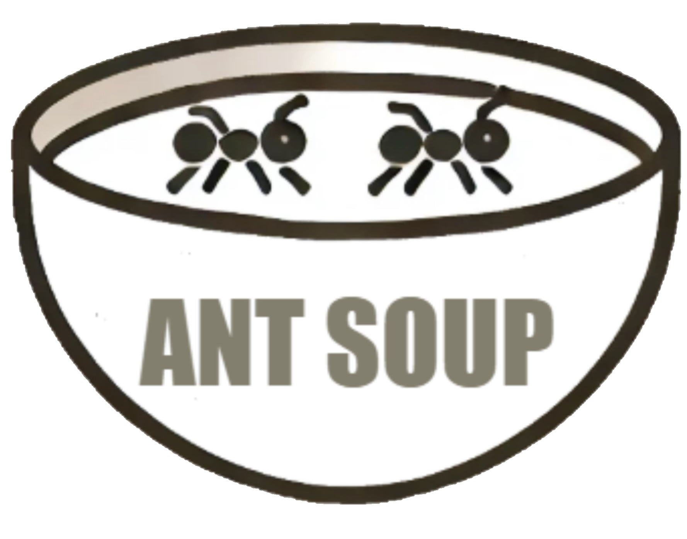

**High School Senior Capstone**
Voice-3d is an in progress CAD program add-on that will integrate Talon-voice into the 3d modeling workspace. The goal is to have the project working primarily with Fusion360 by March 2025. Followed by other CAD programs.

___
Any contributions are greatly appreciated
Code will be updated frequently, as I have the class every other day during the week.
___
Yes, Ant Soup is a term

